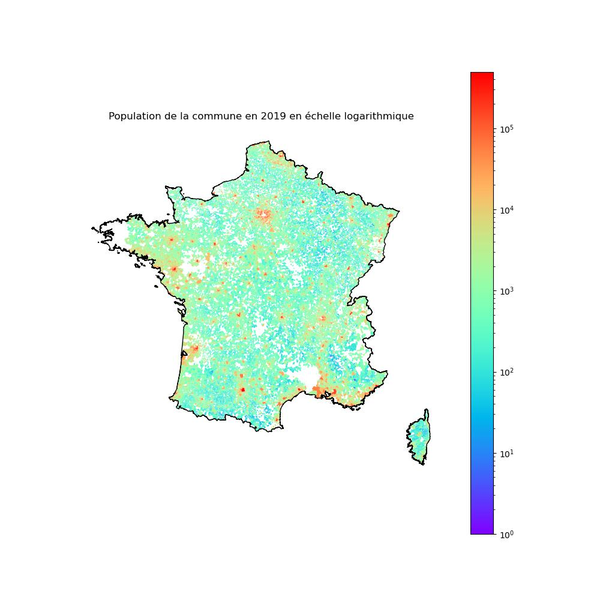

# Projet de Python pour la data-science (OMI2F2) : Prédiction de la réélection des maires français
**Professeur**: M. Lino Galiana

**Chargée de TD**: Mme. Nina Vesseron

**Membres du groupe**: Kilian Andru, Henri de Tricornot, Xavier Lacour

# Ordre des Notebooks
1 - Récupération

2 - Statistiques decriptives

3 - Modélisations

# Introduction

 Notre projet a pour thème les élections municipales françaises. Nous allons essayer de prédire si le maire en place est réélu aux élections municipales suivantes ou non en se basant sur celles de 2014 et 2020. Pour ce faire, nous allons utiliser quatre bases de données.
    

 La première regroupe l’ensemble des maires élus en 2014. Celle-ci est assez simple d’utilisation puisque la liste des maires est donnée. L’élection de 2020 ne comporte pas de base de données la résumant de façon synthétique : nous avons dû en exploiter deux. La première donne les noms des maires élus au premier tour alors que la seconde met à notre disposition les résultats du second tour lorsqu’il y en a eu un. Finalement, la dernière base de données regroupe par ville un ensemble de données socio-économiques à plusieurs dates (telles 2013 et 2019 ce qui correspond aux années précédant les élections municipales, celles-ci ayant lieu tous les six ans). 
    

 Après avoir récupéré les données, nous proposerons quelques statistiques descriptives liées aux maires et aux données socio-économiques municipales. Puis nous proposeront quelques comparaisons entre différents modèles afin de tenter de prédire la réélection d’un maire. Jacques Chirac avait dit « Il faut voter avec son intelligence et non avec ses tripes », si nos concitoyens ont suivi ce précepte, prédire les maires selon les données socio-économiques devrait être possible.

# Contexte du scrutin du 15 mars 2020

 Le premier tour de ces élections municipales de 2020 se tient de façon controversée le 15 mars 2020, en pleine pandémie du Covid-19. En raison de celle-ci, le second tour, initialement prévu le 22 mars, est d'abord reporté sine die, puis au 28 juin suivant.

 De plus, les rassemblements de plus de 100 personnes sont interdits depuis le 13 mars en raison de la pandémie de Covid-19, ce qui conduit à l'annulation de certaines manifestations, mais l'appel national des Gilets Jaunes pour l'acte 70 est maintenu pour le samedi 14 mars, donnant lieu à des violences dans Paris la veille du premier tour du scrutin. Le lundi suivant les résultats du vote, un premier confinement est annoncé, effectif le 17 mars.

 Dans ce contexte de crise sanitaire, mais aussi en raison d'un désintérêt croissant pour la politique selon de nombreux analystes, ces élections sont marquées par un taux d’abstention record (55% au premier tour et 58% au second) alors que ces scrutins locaux mobilisaient historiquement les électeurs. Face à ces incertitudes, on peut donc s’attendre à ce que, plus que d’habitude, les maires soient plus susceptibles d’être réélus que les autres années (forte « prime aux sortants », déjà plus forte aux municipales qu’aux autres élections, serait encore accentuée).

# Fonction des maires [(Source)](https://fr.wikipedia.org/wiki/Maire_(France)#Fonctions_et_responsabilités)

**Mécanisme d’élection des maires**: 

 Pour les communes de moins de 1 000 habitants, il s’agit d’un scrutin majoritaire, plurinominal, à deux tours. Pour les communes de plus de 1 000 habitants, le mode de scrutin combine les règles du scrutin majoritaire à deux tours et celles du scrutin proportionnel.

 Le maire est à la fois agent de l'État et agent de la commune en tant que collectivité territoriale. Les pouvoirs et devoirs du maire sont notamment définis par le Code général des collectivités territoriales (CGCT).

**Comme agent de l’état**: 

 Sous l'autorité du préfet, le maire remplit des fonctions administratives où il agit par pouvoir lié, notamment:

- La publication des lois et règlements

- Le maire dispose également d'une fonction judiciaire civile, qui lui confère le droit de recevoir des actes administratifs qui concernent uniquement son territoire, et ont le même statut que les actes notariés.

**Comme agent de la commune**: 

 Dans ce domaine le maire dispose de pouvoirs propres, avec une large marge d'autonomie et d'appréciation d'application de la loi et de la réglementation notamment dans les matières suivantes:

- Le maire est le chef de l'administration communale. Il est le supérieur hiérarchique des agents de la commune et dispose d'un pouvoir d'organisation des services

- Il est l'ordonnateur des dépenses et des recettes de la commune

- Le maire concourt par son pouvoir de police à l'exercice des missions de sécurité publique et dispose d'une large compétence en matière de police municipale, puisqu'il est notamment chargé d'assurer le bon ordre, la sûreté, la sécurité et la salubrité publiques, la liberté de la voie publique, la prévention et l'organisation des secours contre les catastrophes

- Le maire est chargé de l'exécution des décisions du conseil municipal, et agit sous le contrôle de ce dernier. Ses missions consistent notamment à représenter la commune en justice, passer les marchés, signer des contrats, exécuter le budget, gérer le patrimoine.

**Liens avec les élections**: 

 On peut voir que le maire dispose de nombreux pouvoirs, qui peuvent influencer les données socio-économiques des communes. On peut donc s’attendre à ce que les performances des communes, mesurées par des indicateurs, reflètent le travail du maire; et que les électeurs le prennent en compte dans leurs choix.

# Résultats principaux 

 Une des contributions de ce travail a été d'établir la représentation géographique des certaines données socio-économiques, dans la partie de statistiques descriptives. Le nombre de commune et la densité de population peuvent être ainsi illustrés.

 On peut ainsi observer comment les maires se sont représentés, avec plus ou moins de succès.

 Dans la partie de modélisation, nous avons essayé de mettre en place plusieurs modèles afin de prévoir la réélection des divers maires : régressions dites lasso, régressions logistiques, k plus proches voisins, SVM ou encore un réseau de neurones. Aucun n’a été réellement efficace : bien qu’ayant une accuracy de l’ordre de 85%, les résultats de nos modèles étaient soit similaires soit inférieures au modèle trivial donnant toujours le maire gagnant. On en conclut que dans le contexte d’analyse que nous nous sommes donné, les données socio-économiques d’une ville ne sont pas suffisantes pour prédire si un maire va être réélu. 

 Ce résultat pouvait être anticipé, sachant qu’on a observé très peu de corrélations significatives entre les variables explicatives et l’élection des maires lors des statistiques descriptives. Cela est également conforme à l’analyse de la conjoncture menée plus haut. Du fait de celle-ci, nos données socio-économiques expliquent sans doute moins bien que les autres années les résultats des élections: la même analyse sur les données du scrutin de 2026 pourrait peut-être mieux fonctionner, si les conditions de l’élections sont plus stables. 

 Enfin les pouvoirs des maires ne sont sans doute pas assez larges pour être tenus suffisamment responsables des résultats socio-économiques des villes, affaiblissant le lien de cause à effet entre les données dont nous disposons, et la réélection des maires. Il est donc difficile de conclure si les électeurs ont suivi ou pas le conseil de Jacques Chirac cité plus haut.

# Pour aller plus loin

 Afin d’améliorer nos prédictions, on peut envisager d’intégrer d’autres données mieux corrélées aux résultats électoraux: 

1- Des données sur les campagnes de communication : données sur les campagnes de communication des candidats, telles que le nombre de discours et d'affiches, peuvent être utiles pour prédire l'influence des candidats sur les électeurs.

2- Des données sur les enjeux locaux : données sur les enjeux locaux, tels que les projets de développement de la ville et les questions de sécurité, peuvent être utiles pour prédire comment les électeurs voteront.

3- Des données prises sur les réseaux sociaux : les candidats et les mairies utilisent souvent les réseaux sociaux pour communiquer avec les électeurs et présenter leurs programmes et leurs positions sur les enjeux locaux.